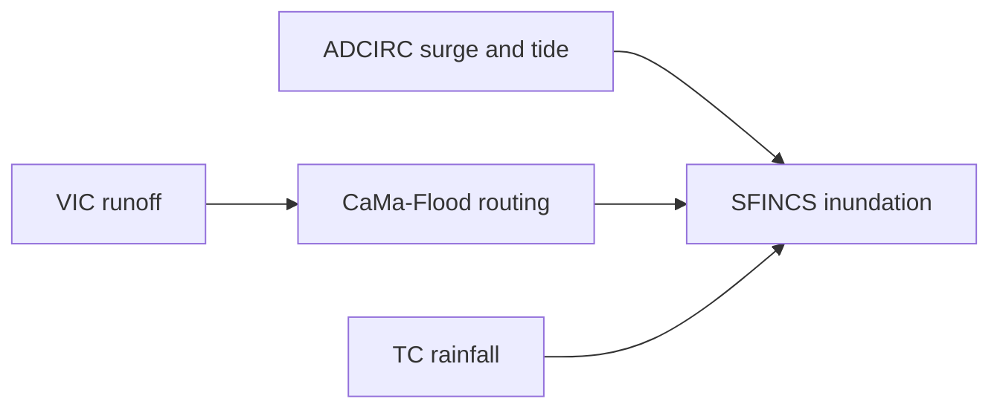

# Anyifang Zhang

I work on compound coastal flood modeling, with a focus on coupling storm surge, river discharge, rainfall-runoff, and high-resolution inundation models.

## Research Interests

- Compound flood modeling
- Coastal inundation and storm surge
- River routing and hydrological modeling
- Tropical cyclone flood hazards
- Multi-model workflow development

## Featured Workflow

`Global Compound Flood Modeling Workflow` organizes the core scripts for a coupled modeling system:

## Models and Tools

| Model | Purpose |
| --- | --- |
| ADCIRC | Storm surge and tidal boundary conditions |
| SFINCS | High-resolution coastal inundation |
| VIC | Land-surface runoff generation |
| CaMa-Flood | Global and regional river routing |

## Current Affiliation

Tsinghua University
